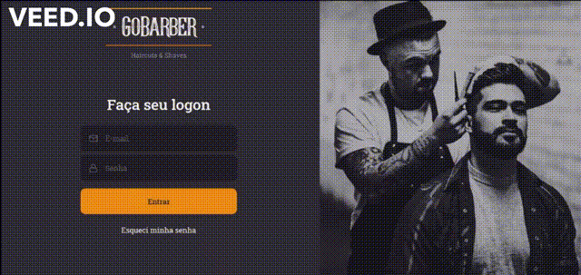

<h1 align="center">GoBarber</h1>

## 💻 O Projeto
Projeto desenvolvido no decorrer do bootcamp gostack

<h1 align="center" class="teste">
  
</h1>

## 💻 O que foi utilizado no projeto
- ReactJS
- ContextApi
- Axios
- Styled-Components
- Unform
- TypeScript

## 🤔 Como contribuir

- Faça um fork desse repositório;
- Cria uma branch com a sua feature: `git checkout -b minha-feature`;
- Faça commit das suas alterações: `git commit -m 'feat: Minha nova feature'`;
- Faça push para a sua branch: `git push origin minha-feature`.

---

Desenvolvido por [William José Dias!](https://github.com/WilliamWJD)
